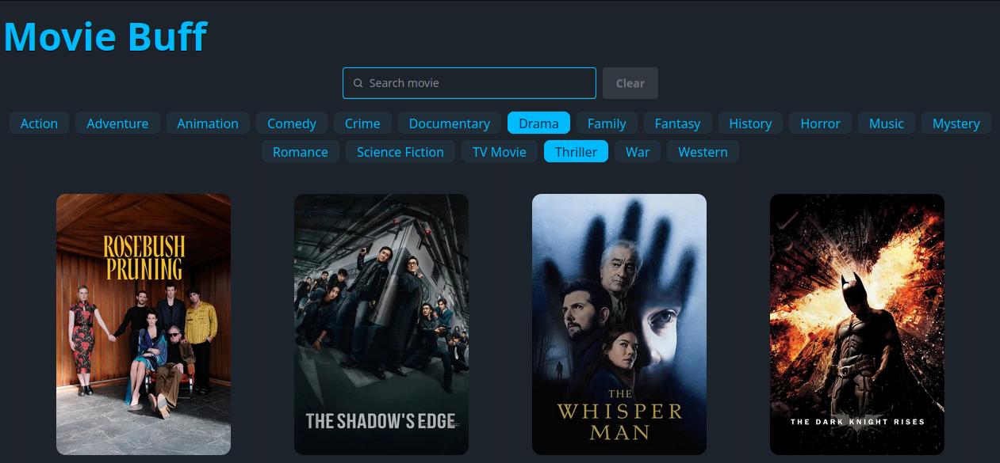

# Movie Buff - React application with TypeScript

## Description
- You can find the movie you want and its details.
- There are different options of genres to seek and watch how the view refresh while you select youre favorite.

## Technologies involved
- React
- TypeScript 
- Tanstack Query
- Axios
- Tailwind CSS
- Daisy UI
- Motion

## Start
- Copy the ***.env.template*** file and rename to ***.env***.
- Check the links in ***.env.template*** to get the keys.
- You must get the environment variables and implement the file ***.env***.

- The App was create with ```pnpm``` so you must run ```pnpm install``` to install dependencies.
- Run ```pnpm dev``` to start application.

